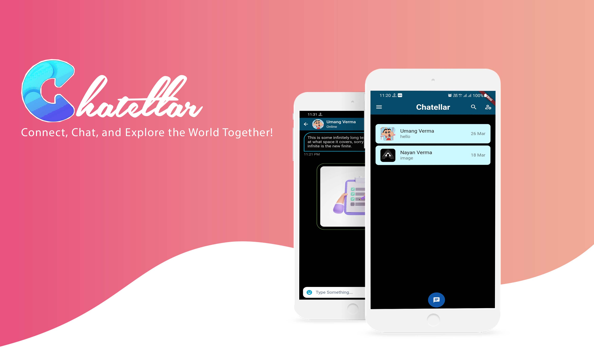

# Chat Application

This is a flutter based modern messaging app where users can sign up and log in to chat with their friends, family, colleagues among groups with enriched User-Experience.

It uses Firebase Cloud Firestore as well as the Firebase authentication package which equips this app with a cloud-based NoSQL database and secure authentication methods.

One of the first simple apps I created while on my journey to learn flutter.

### Demo

  &nbsp;&nbsp;&nbsp;&nbsp;&nbsp;&nbsp;&nbsp;&nbsp;&nbsp;&nbsp;&nbsp;&nbsp;&nbsp;&nbsp;&nbsp;
  &nbsp;&nbsp;&nbsp;&nbsp;&nbsp;
  &nbsp;&nbsp;&nbsp;&nbsp;&nbsp;
   &nbsp;&nbsp;&nbsp;&nbsp;&nbsp;
     &nbsp;&nbsp;&nbsp;&nbsp;&nbsp;
       
  
  
### Dependencies

1. [Font_Awesome_Flutter](https://pub.dev/packages/font_awesome_flutter)

1. [Firebase](https://pub.dev/packages/firebase)

1. [Firebase_Auth](https://pub.dev/packages/firebase_auth)

1. [Animated_Text_Kit](https://pub.dev/packages/animated_text_kit)

1. [Firebase_Core](https://pub.dev/packages/firebase_core)

1. [Cloud_Firestore](https://pub.dev/packages/cloud_firestore)

## Setup

  ##### Clone the repository
```bash
git clone https://github.com/nayan1306/Chatellar.git
```
  ##### Move to the desired folder
```bash
cd \Chatellar
```

  ##### To run the app, simply write
```bash
flutter run
```

## Requirements to contribute

- Basic knowledge of programming is mandatory
- The ability to use Git and GitHub
- Some knowledge of Dart and how to use Flutter is preferrable for a head start.
- UI/UX Design skills are appreciable but not mandatory
- Some idea about Firebase or willingness to learn it

### How to make a Pull Request:

**1.** Fork [this](https://github.com/nayan1306/Chatellar) repository.

**2.** Clone the forked repository.

```terminal
git clone https://github.com/<your-github-username>/Chatellar
```

**3.** Navigate to the project directory.

```terminal
cd Chatellar
```

**4.** Checkout from master to development branch.

```terminal
git checkout development
```
**5.** Make changes in source code.

**6.** Commit your changes.

```terminal
  git add .
  git commit -m "<your_commit_message>"
```

**7.** Push your local branch to the remote repository.

```terminal
git push -u origin development
```

**8.** Create a Pull Request!

**Congratulations!**  :boom: Sit and relax, you've made your contribution to [Chatellar]  (https://github.com/nayan1306/Chatellar) project.


## Tasks and Features

* Improve the UI
* integrate a sentiment analysis model
* show user sentiment through a sentiment screen
* Implementing the App with Features
* Login Page using Facebook, Google
* Work on the improvement and building the various pages of the app
* Database integration with  Firebase
* Have a corresponding Web App for this
* Analyze further design requirements and integrate


For help getting started with Flutter, view the online documentation, which offers tutorials, samples, guidance on mobile development, and a full API reference.

##### Made with 🧠 by <a href="https://github.com/nayan1306">Nayan Verma</a>

[](https://github.com/nayan1306)
